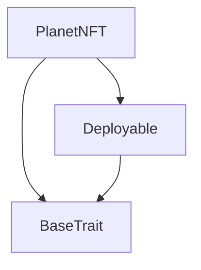
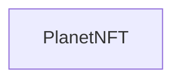

# Tact compilation report
Contract: PlanetNFT
BoC Size: 1047 bytes

## Structures (Structs and Messages)
Total structures: 20

### DataSize
TL-B: `_ cells:int257 bits:int257 refs:int257 = DataSize`
Signature: `DataSize{cells:int257,bits:int257,refs:int257}`

### SignedBundle
TL-B: `_ signature:fixed_bytes64 signedData:remainder<slice> = SignedBundle`
Signature: `SignedBundle{signature:fixed_bytes64,signedData:remainder<slice>}`

### StateInit
TL-B: `_ code:^cell data:^cell = StateInit`
Signature: `StateInit{code:^cell,data:^cell}`

### Context
TL-B: `_ bounceable:bool sender:address value:int257 raw:^slice = Context`
Signature: `Context{bounceable:bool,sender:address,value:int257,raw:^slice}`

### SendParameters
TL-B: `_ mode:int257 body:Maybe ^cell code:Maybe ^cell data:Maybe ^cell value:int257 to:address bounce:bool = SendParameters`
Signature: `SendParameters{mode:int257,body:Maybe ^cell,code:Maybe ^cell,data:Maybe ^cell,value:int257,to:address,bounce:bool}`

### MessageParameters
TL-B: `_ mode:int257 body:Maybe ^cell value:int257 to:address bounce:bool = MessageParameters`
Signature: `MessageParameters{mode:int257,body:Maybe ^cell,value:int257,to:address,bounce:bool}`

### DeployParameters
TL-B: `_ mode:int257 body:Maybe ^cell value:int257 bounce:bool init:StateInit{code:^cell,data:^cell} = DeployParameters`
Signature: `DeployParameters{mode:int257,body:Maybe ^cell,value:int257,bounce:bool,init:StateInit{code:^cell,data:^cell}}`

### StdAddress
TL-B: `_ workchain:int8 address:uint256 = StdAddress`
Signature: `StdAddress{workchain:int8,address:uint256}`

### VarAddress
TL-B: `_ workchain:int32 address:^slice = VarAddress`
Signature: `VarAddress{workchain:int32,address:^slice}`

### BasechainAddress
TL-B: `_ hash:Maybe int257 = BasechainAddress`
Signature: `BasechainAddress{hash:Maybe int257}`

### Deploy
TL-B: `deploy#946a98b6 queryId:uint64 = Deploy`
Signature: `Deploy{queryId:uint64}`

### DeployOk
TL-B: `deploy_ok#aff90f57 queryId:uint64 = DeployOk`
Signature: `DeployOk{queryId:uint64}`

### FactoryDeploy
TL-B: `factory_deploy#6d0ff13b queryId:uint64 cashback:address = FactoryDeploy`
Signature: `FactoryDeploy{queryId:uint64,cashback:address}`

### Mint
TL-B: `mint#23d84d9d queryId:int257 planet:^string receiver:address amount:int257 = Mint`
Signature: `Mint{queryId:int257,planet:^string,receiver:address,amount:int257}`

### SetBaseURI
TL-B: `set_base_uri#6fa0d938 newBaseURI:^string = SetBaseURI`
Signature: `SetBaseURI{newBaseURI:^string}`

### SetRoyalty
TL-B: `set_royalty#2615e809 numerator:int257 denominator:int257 = SetRoyalty`
Signature: `SetRoyalty{numerator:int257,denominator:int257}`

### TokenTransfer
TL-B: `token_transfer#5a05808c nftId:int257 receiver:address = TokenTransfer`
Signature: `TokenTransfer{nftId:int257,receiver:address}`

### CollectionInfo
TL-B: `_ name:^string symbol:^string description:^string nextNFTId:int257 totalMinted:int257 = CollectionInfo`
Signature: `CollectionInfo{name:^string,symbol:^string,description:^string,nextNFTId:int257,totalMinted:int257}`

### RoyaltyInfo
TL-B: `_ numerator:int257 denominator:int257 destination:address = RoyaltyInfo`
Signature: `RoyaltyInfo{numerator:int257,denominator:int257,destination:address}`

### PlanetNFT$Data
TL-B: `_ name:^string symbol:^string description:^string owner:address nextNFTId:int257 totalMinted:int257 baseURI:^string royaltyNumerator:int257 royaltyDenominator:int257 royaltyDestination:address nftOwners:dict<int, address> allowedMinters:dict<address, bool> = PlanetNFT`
Signature: `PlanetNFT{name:^string,symbol:^string,description:^string,owner:address,nextNFTId:int257,totalMinted:int257,baseURI:^string,royaltyNumerator:int257,royaltyDenominator:int257,royaltyDestination:address,nftOwners:dict<int, address>,allowedMinters:dict<address, bool>}`

## Get methods
Total get methods: 0

## Exit codes
* 2: Stack underflow
* 3: Stack overflow
* 4: Integer overflow
* 5: Integer out of expected range
* 6: Invalid opcode
* 7: Type check error
* 8: Cell overflow
* 9: Cell underflow
* 10: Dictionary error
* 11: 'Unknown' error
* 12: Fatal error
* 13: Out of gas error
* 14: Virtualization error
* 32: Action list is invalid
* 33: Action list is too long
* 34: Action is invalid or not supported
* 35: Invalid source address in outbound message
* 36: Invalid destination address in outbound message
* 37: Not enough Toncoin
* 38: Not enough extra currencies
* 39: Outbound message does not fit into a cell after rewriting
* 40: Cannot process a message
* 41: Library reference is null
* 42: Library change action error
* 43: Exceeded maximum number of cells in the library or the maximum depth of the Merkle tree
* 50: Account state size exceeded limits
* 128: Null reference exception
* 129: Invalid serialization prefix
* 130: Invalid incoming message
* 131: Constraints error
* 132: Access denied
* 133: Contract stopped
* 134: Invalid argument
* 135: Code of a contract was not found
* 136: Invalid standard address
* 138: Not a basechain address
* 2746: Not authorized to mint
* 4586: Only owner can set base URI
* 4974: Only owner can set royalty
* 9628: Can only mint 1 NFT at a time
* 28969: Only owner can add minters
* 51041: Not NFT owner
* 63335: Only owner can remove minters

## Trait inheritance diagram

## Contract dependency diagram

