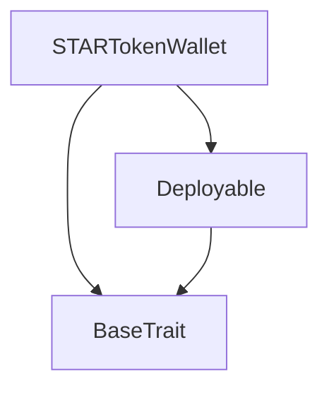
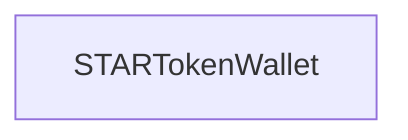

# Tact compilation report
Contract: STARTokenWallet
BoC Size: 481 bytes

## Structures (Structs and Messages)
Total structures: 19

### DataSize
TL-B: `_ cells:int257 bits:int257 refs:int257 = DataSize`
Signature: `DataSize{cells:int257,bits:int257,refs:int257}`

### SignedBundle
TL-B: `_ signature:fixed_bytes64 signedData:remainder<slice> = SignedBundle`
Signature: `SignedBundle{signature:fixed_bytes64,signedData:remainder<slice>}`

### StateInit
TL-B: `_ code:^cell data:^cell = StateInit`
Signature: `StateInit{code:^cell,data:^cell}`

### Context
TL-B: `_ bounceable:bool sender:address value:int257 raw:^slice = Context`
Signature: `Context{bounceable:bool,sender:address,value:int257,raw:^slice}`

### SendParameters
TL-B: `_ mode:int257 body:Maybe ^cell code:Maybe ^cell data:Maybe ^cell value:int257 to:address bounce:bool = SendParameters`
Signature: `SendParameters{mode:int257,body:Maybe ^cell,code:Maybe ^cell,data:Maybe ^cell,value:int257,to:address,bounce:bool}`

### MessageParameters
TL-B: `_ mode:int257 body:Maybe ^cell value:int257 to:address bounce:bool = MessageParameters`
Signature: `MessageParameters{mode:int257,body:Maybe ^cell,value:int257,to:address,bounce:bool}`

### DeployParameters
TL-B: `_ mode:int257 body:Maybe ^cell value:int257 bounce:bool init:StateInit{code:^cell,data:^cell} = DeployParameters`
Signature: `DeployParameters{mode:int257,body:Maybe ^cell,value:int257,bounce:bool,init:StateInit{code:^cell,data:^cell}}`

### StdAddress
TL-B: `_ workchain:int8 address:uint256 = StdAddress`
Signature: `StdAddress{workchain:int8,address:uint256}`

### VarAddress
TL-B: `_ workchain:int32 address:^slice = VarAddress`
Signature: `VarAddress{workchain:int32,address:^slice}`

### BasechainAddress
TL-B: `_ hash:Maybe int257 = BasechainAddress`
Signature: `BasechainAddress{hash:Maybe int257}`

### Deploy
TL-B: `deploy#946a98b6 queryId:uint64 = Deploy`
Signature: `Deploy{queryId:uint64}`

### DeployOk
TL-B: `deploy_ok#aff90f57 queryId:uint64 = DeployOk`
Signature: `DeployOk{queryId:uint64}`

### FactoryDeploy
TL-B: `factory_deploy#6d0ff13b queryId:uint64 cashback:address = FactoryDeploy`
Signature: `FactoryDeploy{queryId:uint64,cashback:address}`

### TokenTransfer
TL-B: `token_transfer#e3901e34 queryId:int257 amount:int257 destination:address responseDestination:address customPayload:Maybe ^cell forwardTonAmount:int257 forwardPayload:^cell = TokenTransfer`
Signature: `TokenTransfer{queryId:int257,amount:int257,destination:address,responseDestination:address,customPayload:Maybe ^cell,forwardTonAmount:int257,forwardPayload:^cell}`

### TokenBurn
TL-B: `token_burn#6543307b queryId:int257 amount:int257 responseDestination:address customPayload:Maybe ^cell = TokenBurn`
Signature: `TokenBurn{queryId:int257,amount:int257,responseDestination:address,customPayload:Maybe ^cell}`

### TokenNotification
TL-B: `token_notification#f6741d60 queryId:int257 amount:int257 from:address forwardPayload:^cell = TokenNotification`
Signature: `TokenNotification{queryId:int257,amount:int257,from:address,forwardPayload:^cell}`

### BurnCosmicUtility
TL-B: `burn_cosmic_utility#4355fde6 queryId:int257 utilityType:^string amount:int257 = BurnCosmicUtility`
Signature: `BurnCosmicUtility{queryId:int257,utilityType:^string,amount:int257}`

### PassiveIncomeInfo
TL-B: `_ perHour:int257 nftCount:int257 dailyEarned:int257 = PassiveIncomeInfo`
Signature: `PassiveIncomeInfo{perHour:int257,nftCount:int257,dailyEarned:int257}`

### STARTokenWallet$Data
TL-B: `_ tokenContract:address owner:address tokenBalance:int257 dailyEarned:int257 lastClaimTime:int257 totalBurned:int257 passiveIncomePerHour:int257 nftOwnedCount:int257 cosmicBurns:dict<address, int> = STARTokenWallet`
Signature: `STARTokenWallet{tokenContract:address,owner:address,tokenBalance:int257,dailyEarned:int257,lastClaimTime:int257,totalBurned:int257,passiveIncomePerHour:int257,nftOwnedCount:int257,cosmicBurns:dict<address, int>}`

## Get methods
Total get methods: 0

## Exit codes
* 2: Stack underflow
* 3: Stack overflow
* 4: Integer overflow
* 5: Integer out of expected range
* 6: Invalid opcode
* 7: Type check error
* 8: Cell overflow
* 9: Cell underflow
* 10: Dictionary error
* 11: 'Unknown' error
* 12: Fatal error
* 13: Out of gas error
* 14: Virtualization error
* 32: Action list is invalid
* 33: Action list is too long
* 34: Action is invalid or not supported
* 35: Invalid source address in outbound message
* 36: Invalid destination address in outbound message
* 37: Not enough Toncoin
* 38: Not enough extra currencies
* 39: Outbound message does not fit into a cell after rewriting
* 40: Cannot process a message
* 41: Library reference is null
* 42: Library change action error
* 43: Exceeded maximum number of cells in the library or the maximum depth of the Merkle tree
* 50: Account state size exceeded limits
* 128: Null reference exception
* 129: Invalid serialization prefix
* 130: Invalid incoming message
* 131: Constraints error
* 132: Access denied
* 133: Contract stopped
* 134: Invalid argument
* 135: Code of a contract was not found
* 136: Invalid standard address
* 138: Not a basechain address
* 14607: No NFTs owned
* 21543: Only owner can burn
* 26825: Only owner can withdraw
* 28070: Only token contract can notify
* 36952: Only owner can transfer
* 41370: Only owner can claim
* 44933: Insufficient balance to burn
* 51095: Only owner can update NFT ownership
* 51144: Burn amount must be positive
* 54615: Insufficient balance
* 61135: Amount must be positive

## Trait inheritance diagram

## Contract dependency diagram

